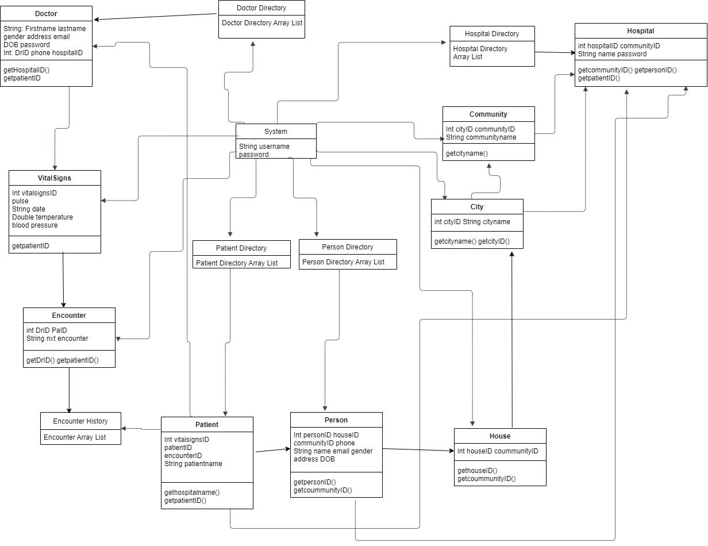
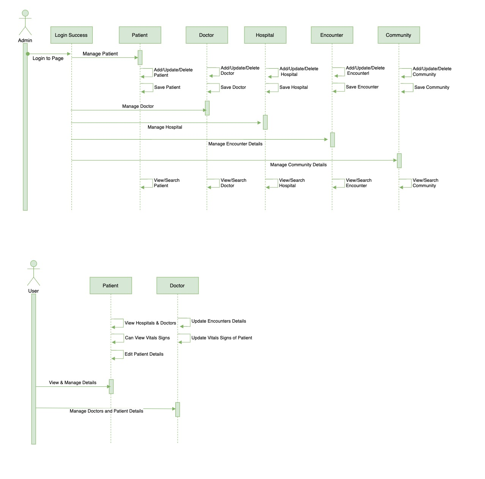

# Lissa_Rodrigues_002769776 Hospital Repository

# Detailed Project Description

The hospital management system is developed utilizing the Java Swing and Netbeans IDE 
programming languages. The hospital management system consists of five sections:  

- Administrators
- Doctors
- Patients
- Hospital Admins
- Commnity Admins

### System Admin:
It is the responsibility of the system administrator to create, read, update, and delete patients, 
doctors, hospitals, and encounters.
Every attribute's creation reveals two buttons, the first for creating the attribute and the 
second for seeing its information.
When an administrator clicks the create patient button, a workspace for a create patient form 
opens, into which the administrator can enter the patient's information.
These details will be displayed when the administrator presses the view button, along with a 
table where you may examine, edit, and delete the new patient's data.
Similarly, attributes such as physicians, hospitals, and encounters panels adhere to the same 
procedure.

### Hospital Admin

Hospital admin is identical to system admin, with the exception that the hospital admin cannot
delete any fields associated with the patient, doctor, hospital, or encounters.

### Community Admin

Community has access to attributes such as city, community, and house. clicking a create button opens 
a work panel where users can build, view, and update cities. The construct community and house buttons perform the identical function.

### Doctor
Doctor possesses the ability to view and create encounters. The doctor's primary responsibility 
is to create a Vital signs history and the time of the patient's visit.
The Vital Signs features three really useful attributes, such as heart rate, height, and weight.
These entered data are retrieved in the view encounter tab, which displays the data in table
format and contains an edit button for modifying the patient's information.

### Patient
Patients can schedule an appointment with the doctor and there is a tab for 
encounters with a data storage table and a view form for patient information.

### Class Diagram

### Sequence Diagram

### Run this project

- Clone or download zip file from this repo
- Open as Project in netbans
- Click right click on project and then click on run button